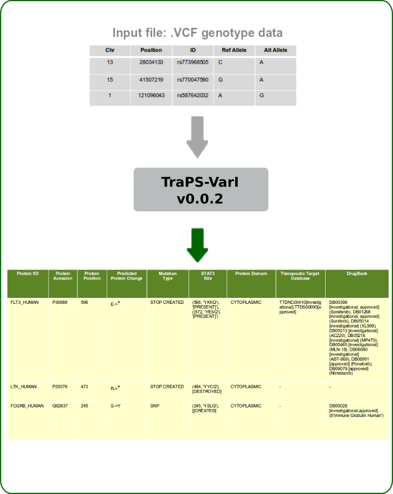

.. TraPS-VarI documentation master file, created by
   sphinx-quickstart on Sun Aug  6 19:35:08 2017.
   You can adapt this file completely to your liking, but it should at least
   contain the root `toctree` directive.

.. toctree::
   :maxdepth: 2
   :caption: Contents:

**TraPS-VarI** (Transmemrane Protein Sequence Variant Identifier) is a tool to map the single nucleotide polymorphism mutations recorded in **.vcf** (VCF 4.0) files to the protein topology and predict the effect of an individual-specific genotype on the presence or absence of membrane-proximal SH2 binding motifs such as,

* STAT3 binding site [YxxQ],
* ITIMs (immunoreceptor tyrosine-based **inhibition** motif) [S/I/V/LxYxxI/V/L]
* ITAMs (immunoreceptor tyrosine-based **activation** motif) [YxxI/Lx(6-30)YxxI/L]

Additionally, the algorithm also finds matches for Uniprot Protein Name entries with the records of the therapeutic target database (ttd) and DrugBank.

************
Installation
************
TraPS-VarI will add itself as a module to python.

Requirements
************

* python 3.4 or newer
* MySQLdb module for python (MySQL-python)
* access to a MySQL database (InnoDB engine with spatial index support - v5.7 or higher)

.. warning:: MySQL library has to be configured manually to enable successful integration of TraPS-VarI database

How to Install
**************
Extract the package to the desired install location and run the installation script with the command:
			python install.py

and simply follow the instructions appearing on the commandline

*****
Usage
*****

python TraPS_VarI.py {−p=<CHR: POS> −m=<REF/ALT >| −f=<filename> [options]} [−assembly=<assemblyversion>]

* -p=chr:pos to look up a single mutation (i.e. A/T) at the position chr:pos (only with -m)
* -m=REF/ALT mutation to look up (only in conjunction with -p)
* -f= to run the script on a file in vcf format
* -fout file to save the result to (default is inputfile traps vari output)
* -filter use to omit all lines from the result that do not contain a transmembrane protein mutation
* -assembly=37/38 (which assembly to use, dbSNP is only supported for 38)

.. note:: The script will generate output files namely -TraPS_VarI.Output-1, 2 & 3 each with the following appended columns:-
	
	1. Uniprot Entry name,
	2. Uniprot Entry ID,	
	3. Protein position, 
	4. Protein aminoacid change, 
	5. Mutation effect,
	6. Tyrsoine-based sequence motifs such as SH2 binding YxxQ, ITAM & ITAM (with annotations CREATED, DESTROYED or PRESENT),
	7. Topology domain, 
	8. Hits in the TTD database and 
	9. Hits in the DrugBank database.

***************
How it works
***************
TraPS-VarI processes the vcf file line by line. It takes the position, matches this against
coding reqions in the RefSeq database. It then matches the CDS to it’s appropriate
UniProt entry, modifies the CDS according to the mutation and retranslates the resulting
CDS. The effect of the mutation is derived from the difference between those two entries.
In it’s current version it only matches against UniProts main entries and not their
isoforms (support for this is planned). It also looks up the position and mutation in the
dbSNP dataset, if the mutation is contained there it adds the dbSNPid to the entry. It
also checks the found refseq and uniprot ids against the TTD and DrugBank databases.

*****************
Summary
*****************

***********
Source code
***********

https://gitlab.com/VJ-Ulaganathan/TraPS-VarI

***********************
Biological Significance
***********************

Motif-1
********

* The **STAT3 binding** motifs (YXXQ) are present in the juxtamembrane regions of many transmembrane receptors that are expressed in many cell types. Recruitment of STAT3 to the tyrosine-phosphorylated YXXQ motifs significantly enhances the amplitude of STAT3 signaling. Depending on the cell/tissue-specific expression patterns of the receptor variant, pleiotropic effects are expected in vivo. Ubiquitous expression of STAT3-enhancing, gain-of-function SNPs in the germline genome contributes to accelerated cancer progression & poor prognosis. However, cells are rendered sensitive in a genotype/allele-specific manner to growth inhibition by small molecule or RNA interference mediated inhibition of STAT3 signaling pathways (Ulaganathan et al, Nature 2015: https://doi.org/10.1038/nature16449).

**An example of TraPS-VarI identified STAT3 motif-creating germline variant:**

Chr1 1211745 C/T (rs776902723): TNFRSF4_p.R241Q = [YLL(R/Q)]

Motif-2
********

* The immunoreceptor tyrosine-based **inhibition** motifs (ITIM) are present in the cytoplasmic domains of transmembrane receptors of virtually all immune cells. Recruitment of specific phosphatases to the tyrosine-phosphorylated ITIM results in the complete inhibition or downmodulation of immune cell effector functions (Daëron et al, Immunity 1995: https://doi.org/10.1016/1074-7613(95)90134-5)

**An example of TraPS-VarI identified ITIM motif-creating germline variant:**

Chr2 203734829 A/G (rs200221759): CD28_p.M194V = [SDYMN(M/V)]

Motif-3
********

* The immunoreceptor tyrosine-based **activation** motif (ITAM) was initially recognized as a common sequence in the cytoplasmic tails of the signaling chains associated with the T-cellreceptor (TCR), B-cell receptor (BCR), and certain Fc receptors. Dual-tyrosine phosphorylated ITAM serve as docking sites for various proteins such as the tandem SH2 domains of Syk family PTK, viz., ZAP-70 or Syk and are important for positive signal transduction in immune cells (Reth, Nature 1989: https://doi.org/10.1038/338383b0).

**An example of TraPS-VarI identified ITAM motif-creating germline variant:**

Chr4 38796959 T/A (rs202172776): TLR1_p.N625Y = [YLDLPWYLRMVCQWTQTRRRAR(N/Y)IPL]

Thus TraPS-VarI can serve as an important tool for annotation of individual-specific genotyping dataset.

******************
Graphical Summary
******************

*********************************
Illustration for using TraPS-VarI
*********************************

Step-wise illustration demonstrating how to use TraPS-VarI for analyzing a person's SNP genotype dataset.

step-1: Obtaining '.vcf' file 
******************************************************************************

.. image:: image/getting-patient.data.gif

step-2: Executing
******************************************************************************

step-3: Progress
******************************************************************************

.. image:: image/progress.gif

step-4: Validation
******************************************************************************

.. image:: image/output.gif

Support
*******
The manuscript describing this tool is on the way. Citation records will be updated as soon as possible.
Meanwhile, if you found "TraPS-VarI" useful you may cite our pre-print publication as follows:

Kogan D, Ulaganathan VK. 2017. TraPS-VarI: a python module for the identification of STAT3 modulating germline receptor variants. bioRxiv doi: 10.1101/173047

Example for usage:
******************
If you are looking for an example on how to use this tool for biological research, you may find our recent paper published in "Journal of Clinical Investigation" useful:-

Video Summary:
https://vj-ulaganathan.github.io/

Research Publication:

STAT3-enhancing germline mutations contribute to tumor-extrinsic immune evasion
Daniel Kogan, … , Christian Faul, Vijay Kumar Ulaganathan
Published May 1, 2018; First published February 13, 2018
Citation Information: 
	J Clin Invest. 2018;128(5):1867-1872. https://doi.org/10.1172/JCI96708.

If you have any questions or suggestions, please feel free to drop me a line at: 
	ulaganat@icloud.com

